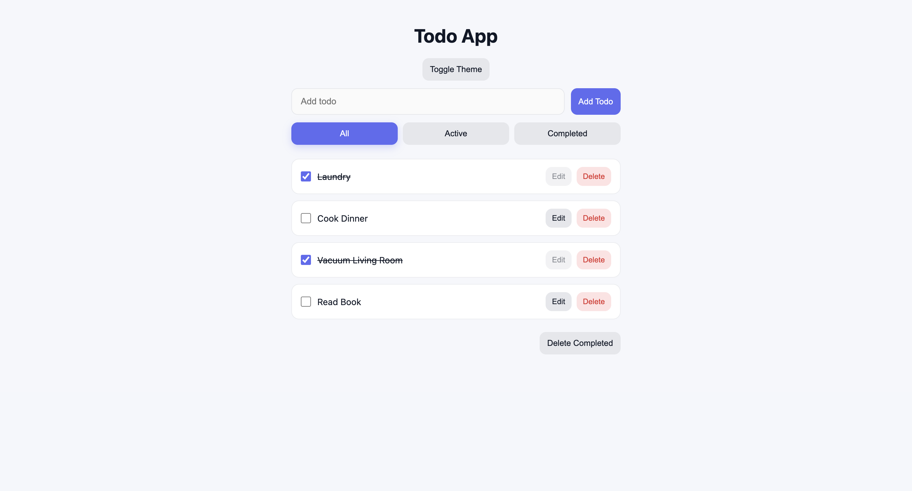
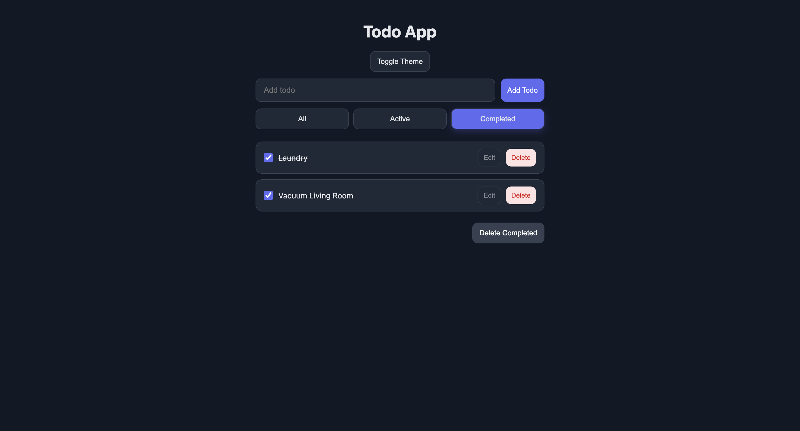

# Todo App

A simple and responsive Todo application built with React, TypeScript, and Context API. Users can add, edit, delete, complete, and filter tasks while switching between light and dark themes.

## Features

- Add new todos
- Edit existing todos
- Mark todos as completed
- Delete individual todos
- Delete all completed todos
- Filter tasks:
  - All
  - Active
  - Completed
- Light and dark theme toggle
- Saves selected theme using localStorage
- Responsive design

## Built With

- React
- TypeScript
- Context API
- CSS
- Vite

## Getting Started

### Clone the repository
git clone https://github.com/vbolden/ContextAPI_todo_list.git

### Install dependencies
npm install

### Start the development server
npm run dev

### App will run locally at:
http://localhost:5173

## Project Structure
src/
├── components/
│   ├── TodoInput
│   ├── TodoItem
│   ├── TodoList
│   ├── FilterButtons
│   └── ThemeButton
│
├── context/
│   ├── TodoContext
│   ├── FilterContext
│   └── ThemeContext
│
├── providers/
│   └── TodoProvider
│
└── App.tsx

## Screenshots

### Light Mode

### Dark Mode

## License
This project is for learning and portfolio purposes.